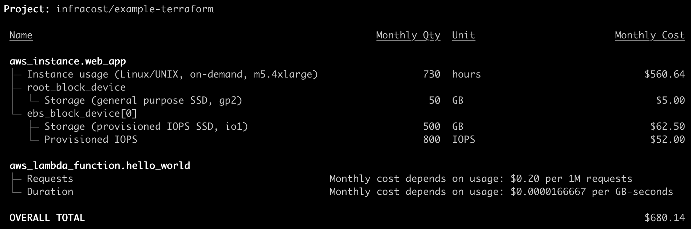
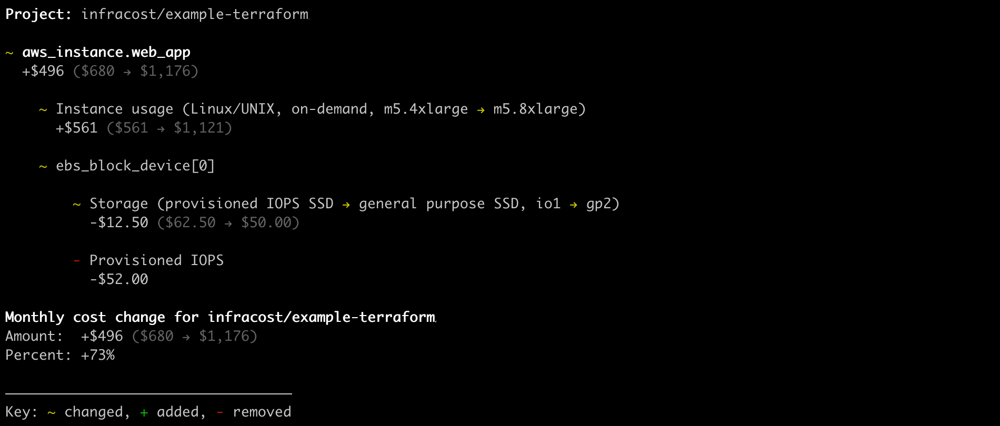
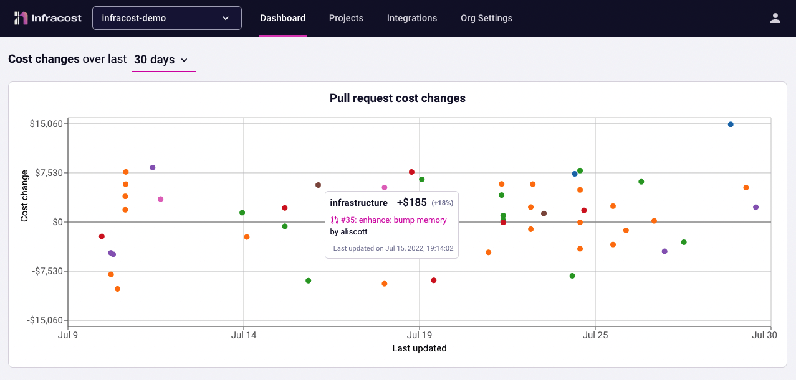

# infracost-estimate-cloud-costs

# 🚀 Cloud cost estimates for Terraform in pull requests💰📉 Love your cloud bill! 🚀

https://github.com/coding-to-music/infracost-estimate-cloud-costs

From / By InfraCost https://github.com/infracost/infracost

https://github.com/infracost/infracost

https://www.infracost.io/

## Environment variables:

```java

```

## GitHub

```java
git init
git add .
git remote remove origin
git commit -m "first commit"
git branch -M main
git remote add origin git@github.com:coding-to-music/infracost-estimate-cloud-costs.git
git push -u origin main
```

<p align="center">
<a href="https://www.infracost.io"></a>

<p align="center">Infracost shows cloud cost estimates for Terraform. It lets DevOps, SRE and engineers see a cost breakdown and understand costs <b>before making changes</b>, either in the terminal or pull requests.</p>
</p>
<p align="center">
<a href="https://www.infracost.io/docs/"></a>

<a href="https://www.infracost.io/community-chat"></a>
<a href="https://twitter.com/intent/tweet?text=Get%20cost%20estimates%20for%20Terraform%20in%20pull%20requests!&url=https://www.infracost.io&hashtags=cloud,cost,terraform"></a>
</p>

## Get started

Follow our [**quick start guide**](https://www.infracost.io/docs/#quick-start) to get started 🚀

Infracost also has many CI/CD integrations so you can easily post cost estimates in pull requests. This provides your team with a safety net as people can discuss costs as part of the workflow.

#### Post cost estimates in pull requests


#### Output of `infracost breakdown`


#### `infracost diff` shows diff of monthly costs between current and planned state


## Supported clouds and resources

Infracost supports over **230** Terraform resources across [AWS](https://www.infracost.io/docs/supported_resources/aws), [Azure](https://www.infracost.io/docs/supported_resources/azure) and [Google](https://www.infracost.io/docs/supported_resources/google). Other IaC tools, such as [Pulumi](https://github.com/infracost/infracost/issues/187), [AWS CloudFormation/CDK](https://github.com/infracost/infracost/issues/190) and [Azure ARM/Bicep](https://github.com/infracost/infracost/issues/812) are on our roadmap.

Infracost can also estimate [usage-based resources](https://www.infracost.io/docs/usage_based_resources) such as AWS S3 or Lambda!

## Community and contributing

Join our [community Slack channel](https://www.infracost.io/community-chat) to learn more about cost estimation, Infracost, and to connect with other users and contributors. Checkout the [pinned issues](https://github.com/infracost/infracost/issues) for our next community call or [our YouTube](https://www.youtube.com/playlist?list=PLZHI9QofNPJQS9Hz0P5zfsl0AC03llbMY) for previous calls.

We ❤️ contributions big or small. For development details, see the [contributing](CONTRIBUTING.md) guide. For major changes, including CLI interface changes, please open an issue first to discuss what you would like to change.

Thanks to all the people who have contributed, including bug reports, code, feedback and suggestions!

<a href="https://github.com/infracost/infracost/graphs/contributors">
  
</a>

## License

[Apache License 2.0](https://choosealicense.com/licenses/apache-2.0/)

# Get started

https://raw.githubusercontent.com/infracost/docs/master/docs/getting_started.md

## Get started with Infracost in your Terraform workflow, integrate it into your CI pipeline and view cost estimates for your AWS/Azure/Google infrastructure.

Infracost shows cloud cost estimates for Terraform. It lets DevOps, SRE and engineers see a cost breakdown and understand costs **before making changes**, either in the terminal or pull requests. This provides your team with a safety net as people can discuss costs as part of the workflow.

If you're upgrading from an older version, see the [v0.10 migration guide](/docs/guides/v0.10_migration/).

### 1. Install Infracost

### macOS / Linux manual

The easiest way is to use our install script:

# Downloads the CLI based on your OS/arch and puts it in /usr/local/bin

```
curl -fsSL https://raw.githubusercontent.com/infracost/infracost/master/scripts/install.sh | sh
```

Or you can install it manually:

- Download the archive for your platform from our releases.
- Unarchive and copy it to one of the directories in your $PATH, e.g. /usr/local/bin:

```
tar xzf infracost-linux-amd64.tar.gz -C /tmp
```

```
mv /tmp/infracost-linux-amd64 /usr/local/bin/infracost
```

Check that it works correctly:

```
infracost --version # Should show 0.10.10
```

### Get the latest Infracost release using docker:

```shell
docker pull infracost/infracost:ci-latest

docker run --rm \
  -e INFRACOST_API_KEY=see_following_step_on_how_to_get_this \
  -v $PWD/:/code/ infracost/infracost:ci-latest breakdown --path /code/
  # Add other required flags/envs, e.g. --terraform-var-file or --terraform-var

docker run --rm \
  -e INFRACOST_API_KEY=$INFRACOST_API_KEY \
  -v $PWD/:/code/ infracost/infracost:ci-latest breakdown --path /code/
```

Output

```

```

### 2. Get API key

Register for a free API key, which is used by the CLI to retrieve prices from our Cloud Pricing API, e.g. get prices for instance types.

note

- No cloud credentials or secrets are [sent](/docs/faq/#what-data-is-sent-to-the-cloud-pricing-api) to the API and you can also [self-host](/docs/cloud_pricing_api/self_hosted/) it.
- Infracost does not make any changes to your Terraform state or cloud resources.

```shell
infracost auth login

# Or

infracost configure set api_key MY_API_KEY
```

The key can be retrieved with `infracost configure get api_key`.

### Generating plan JSON files​

By default, the Infracost CLI parses Terraform HCL code to estimate costs. If that does not work for your use-case, or you already have a Terraform plan JSON file, Infracost can also parse that. See the relevant Terraform CLI, Terraform Cloud or Terragrunt sections below on how to generate plans. These bash scripts can be modified and used in your CI/CD pipelines.

Terraform CLI​
The Terraform CLI can be used to produce a plan JSON file as shown below:

Single project​

```
cd path/to/code

terraform init
### Customize this to how you run Terraform
### e.g. if you are using variables you can pass them with -var or -var-file

terraform plan -out tfplan.binary
terraform show -json tfplan.binary > plan.json

infracost breakdown --path plan.json
```

### 3. Show cost estimate breakdown

Infracost parses the project locally to determine resource types and quantities needed to calculate costs. The [`--path` flag](/docs/features/cli_commands/#breakdown) can point to a Terraform directory or plan JSON file.

```shell
# You can also: git clone https://github.com/infracost/example-terraform
cd my-terraform-project
```

```shell
# Terraform variables can be set using --terraform-var-file or --terraform-var
infracost breakdown --path .
```

<p>
Example output:


</p>

:::tip
Infracost can also estimate [usage-based resources](/docs/features/usage_based_resources/) such as AWS S3 or Lambda
:::

---

### 4. Show cost estimate diff

<ol type="i">
  <li>Generate an Infracost JSON file as the baseline:</li>

```shell
infracost breakdown --path . --format json --out-file infracost-base.json
```

  <li>Edit your Terraform project. If you're using our example project, try changing the instance type:</li>

```shell
vim main.tf
```

  <li>Generate a diff by comparing the latest code change with the baseline:</li>

```shell
infracost diff --path . --compare-to infracost-base.json
```

</ol>

<p>
Example output:


</p>

---

### 5. Monitor cost estimates

<ol type="i">
  <li>The following environment variable instructs the CLI to send its JSON output to Infracost Cloud. This is our SaaS product that builds on top of Infracost open source and works with CI/CD integrations (next step). It enables team leads, managers and FinOps practitioners to see all cost estimates from a central place so they can help guide the team.</li>

```shell
INFRACOST_ENABLE_CLOUD=true infracost diff \
    --path . --compare-to infracost-base.json
```

  <li>
    Log in to <a href="https://dashboard.infracost.io">Infracost Cloud</a> > <b>Projects</b> page to see the cost estimate.
  </li>
</ol>



### 6. Add to your CI/CD

[Use our CI/CD integrations](/docs/integrations/cicd) to add cost estimates to pull requests, it only takes 15 minutes. This provides your team with a safety net as people can understand cloud costs upfront, and discuss them as part of your workflow.

If you run into any issues, please join our [community Slack channel](https://www.infracost.io/community-chat), we'll help you very quickly 😄


## Add to CI/CD

Use one of our many integrations so DevOps, SRE and engineers see a cost estimate in pull requests **before making changes**. This provides your team with a safety net as people can understand cloud costs upfront, and discuss them as part of your workflow.

Infracost can work with either a [Terraform directory](/docs/features/cli_commands/#option-1-terraform-directory) or [Terraform plan JSON](/docs/features/cli_commands/#option-2-terraform-plan-json).

Screenshot of Infracost running in GitHub pull requests:


### Other CI/CD systems

Infracost can be used in any CI/CD system using the following steps. Our [GitLab CI integration](https://gitlab.com/infracost/infracost-gitlab-ci/) follows these steps and has [examples](https://gitlab.com/infracost/infracost-gitlab-ci/#examples) that you might find useful.

1. Use one of the following options to add the Infracost CLI into your CI/CD:

   We maintain specific [CI Docker images](https://hub.docker.com/r/infracost/infracost/tags):

   ```text
   infracost/infracost:ci-0.10 - Recommended, use latest 0.10.x version to pick up bug fixes and new resource costs
   infracost/infracost:ci-0.10.x - Lock the version, see versions in https://github.com/infracost/infracost/releases
   infracost/infracost:ci-latest - Use latest Infracost image, might break when new minor/major versions are released
   ```

   Use `curl -O -L https://infracost.io/downloads/v0.10/infracost-linux-amd64.tar.gz` to download the latest 0.10.x version to pick up bug fixes and new resource costs. You can also use lock the version using our [releases](https://github.com/infracost/infracost/releases), or use [latest](tps://github.com/infracost/infracost/releases/latest/download/infracost-linux-amd64.tar.gz), which might break when new minor/major versions are released.

2. If your infra code is in GitHub, GitLab and Azure Repos or Bitbucket, run the [breakdown, diff and comment commands](/docs/features/cli_commands/#comment-on-pull-requests) to generate a cost estimate and post a comment directly.

Otherwise, run the [breakdown, diff and output commands](/docs/features/cli_commands/#combined-output-formats) to save the comment markdown (e.g. using `--format github-comment`) and post it from your CI/CD system using curl or other command line tools.

You might also find the [environment variables](/docs/features/environment_variables) page useful.

If you run into any issues, please join our [community Slack channel](https://www.infracost.io/community-chat), we'll help you very quickly 😄

### Third-party integrations

Infracost can also be used alongside many other [third-party systems](/docs/integrations/third_party_integrations/) including Terraform Cloud/Enterprise, Env0, Scalr and Spacelift.
